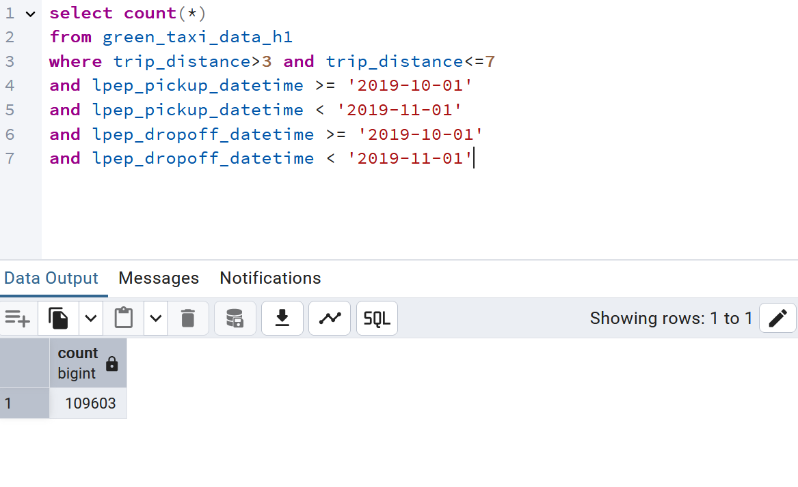
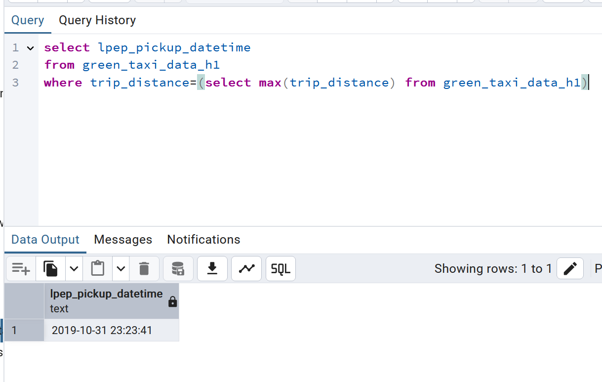
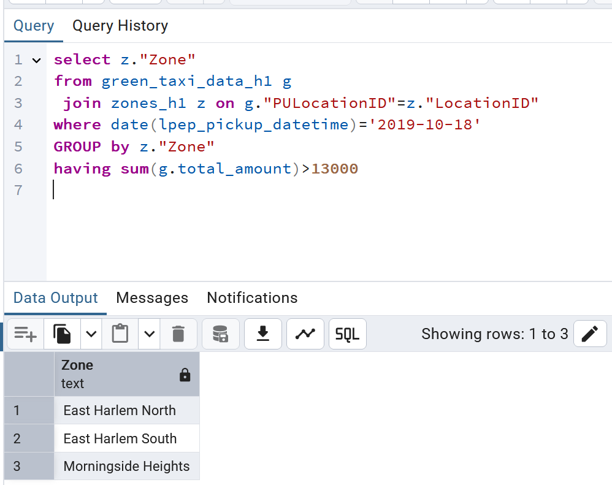
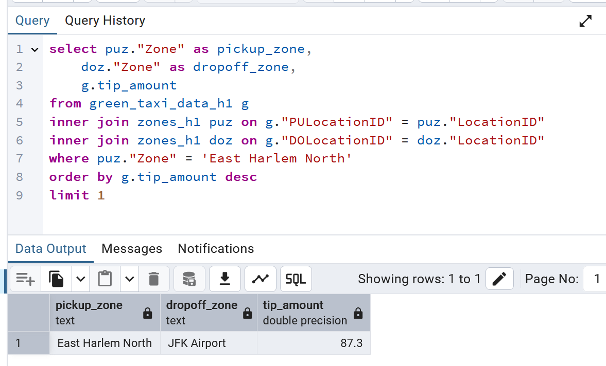

## SQL Queries for Q3 - Q7

### Question 3

2nd option is the correct answer. Similarly, we can check and confirm other cases too

### Question 4

4th option is correct. 

### Question 5

1st option is correct. Note- Double quotes are required on column names used in query

### Question 6

2nd option is correct